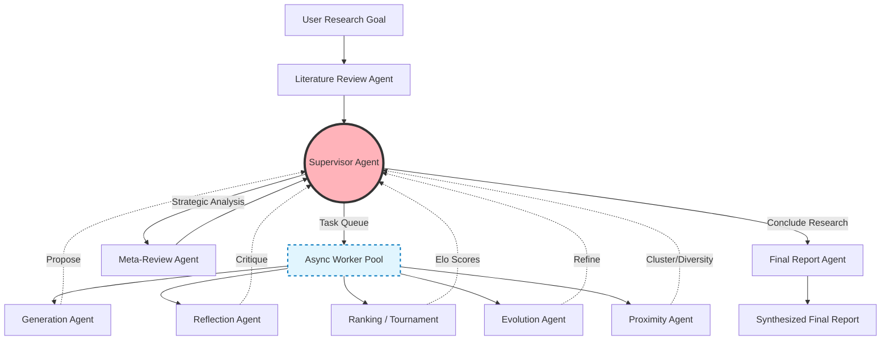

<div align="center">

# 🚀 Project Nova: Autonomous AI Co-Scientist

**A fully autonomous, LangGraph-powered multi-agent system that accelerates the scientific research lifecycle—from deep literature review to novel hypothesis generation and rigorous evaluation.**

*Inspired by Google DeepMind's [AI Co-Scientist](https://arxiv.org/abs/2502.18864).*

[](https://www.python.org/)
[]()
[](https://opensource.org/licenses/Apache-2.0)

</div>

---

## 📖 Overview

Scientific research is traditionally a slow, human-intensive process. **Project Nova** transforms this paradigm by introducing an ecosystem of collaborative AI agents that act as autonomous researchers. 

This system simulates the peer-reviewed environment of a real-world scientific laboratory. By heavily engineering the backend—integrating asynchronous task queues, persistent vector databases (ChromaDB), Corrective RAG, and an objective Elo tournament—Project Nova moves past simple LLM text generation into the realm of closed-loop reasoning engines.

Whether you are a researcher looking for new angles on a tough problem or a developer exploring multi-agent architectures, Project Nova provides a robust pipeline from initial question to a synthesized, publication-ready research report.

---

## 🎯 Architecture: The Agent Ecosystem

Project Nova employs a modular architecture where distinct agents handle specific cognitive tasks. The entire workflow is orchestrated by a central Supervisor, utilizing an asynchronous worker queue to ensure focused, parallelized, and goal-oriented research.



- 📚 **Literature Review Agent**: Systematically decomposes the primary research goal into manageable subtopics and conducts comprehensive literature analysis.
- 💡 **Generation Agent**: Synthesizes the literature foundation to brainstorm and create novel, testable scientific hypotheses.
- 🔍 **Reflection Agent**: Performs deep verification and causal reasoning analysis to ensure scientific groundedness.
- 🏆 **Ranking Agent**: Manages a pairwise Elo-based tournament to force hypotheses to compete. Only the strongest, most scientifically rigorous ideas survive.
- 🧬 **Evolution Agent**: Refines and iterates upon existing hypotheses based on critical feedback and their tournament performance.
- 🌐 **Proximity Agent**: Maintains diversity by building a semantic graph of hypothesis similarities, preventing mode collapse and encouraging broad exploration.
- 👨‍🔬 **Supervisor Agent**: The orchestrator. Analyzes system state, manages compute budgets, and dynamically dispatches tasks (Generation, Evolution, Reflection) to an asynchronous worker queue.
- 📈 **Meta-Review Agent**: Synthesizes insights across multiple research directions and advises the Supervisor on high-level strategy.
- 📝 **Final Report Agent**: Compiles all findings, top-performing hypotheses, and strategic analysis into a comprehensive final report.

---

## 🔬 Real-World Validation: Epigenetic Drivers of Liver Fibrosis

To validate the architecture, the system was tasked with a complex biomedical goal: *"Identify a novel epigenetic modification or therapeutic target that drives liver fibrosis, and propose a therapeutic hypothesis."*

The system operated completely autonomously, utilizing **Gemini 3.5 Flash** for heavy reasoning tasks (tournaments, evolution) and **GPT-4o Mini** for lighter tasks (CRAG query rewriting, summarization). 

### The Top Hypothesis (H7): Metabolic-Epigenetic Imprinting
The system's highest-ranked hypothesis (Elo: 1261.3) successfully proposed a highly novel paradigm shift:
- **Mechanism:** Injured hepatocytes lose methionine metabolizing capacity, flooding the microenvironment with homocysteine. Hepatic stellate cells (HSCs) import this, mistakenly converting it to highly reactive homocysteinethiolactone (HTL).
- **The Epigenetic Mark:** HTL non-enzymatically reacts with Histone H3 at Lysine 9, creating **H3K9homo**, which sterically occludes the SUV39H1 methyltransferase.
- **Therapeutic Angle:** HSC-targeted Lipid Nanoparticles (LNPs) delivering Bleomycin Hydrolase (BLH) to hydrolyze HTL.

### Quantitative Evaluation
We evaluate the system not just on the text it produces, but on the robustness of its end-to-end algorithmic pipeline. 

#### 1. Scientific Hypothesis Quality Index (SHQI)
The winning hypothesis scored a **71.9 / 100**, categorizing it as a highly novel, testable, and grant-worthy research proposal.
- **Novelty & Originality:** 4.5 / 5.0
- **Testability & Falsifiability:** 4.8 / 5.0
- **Therapeutic Impact:** 4.0 / 5.0

#### 2. AI Co-Scientist Benchmark Score (ACBS)
Evaluating the entire algorithmic pipeline's ability to integrate evidence and optimize computational efficiency yielded an ACBS of **74.63 / 100**.

#### 3. Economic Telemetry
By relying on the asynchronous orchestration framework and dual-LLM routing, the system generated a full 10-hypothesis portfolio with a highly optimized economic footprint:
- **Total LLM Calls:** 105
- **Total Tokens Processed:** 210,620
- **Total Execution Latency:** 687.83 seconds (~11.5 minutes)
- **Final Diversity Score (Cosine Distance):** 0.3339

---

## 🚀 Getting Started

Follow these steps to run your own autonomous research lab.

### Prerequisites
- **Python 3.12 or higher**
- Required API Keys for Gemini, OpenAI, and LangSmith (for observability).

### 1. Installation

Clone the repository and install the dependencies:

```bash
git clone https://github.com/your-username/project-nova.git
cd project-nova
pip install -r requirements.txt
```

### 2. Configuration

Set up your environment variables in your `.env` file or export them directly in your terminal:

```bash
# Core AI Models
export GEMINI_API_KEY="your-google-gemini-key"   # For heavy reasoning (Gemini 3.5 Flash)
export OPENAI_API_KEY="your-openai-key"          # For fast processing (GPT-4o Mini)

# Optional: Web Search & Retrieval (If using Tavily instead of PubMed/Arxiv)
export TAVILY_API_KEY="your-tavily-api-key"

# Observability (Highly Recommended)
export LANGSMITH_API_KEY="your-langsmith-key"
export LANGCHAIN_TRACING_V2="true"
export LANGCHAIN_PROJECT="Project-Nova"
```

### 3. Starting a Research Run

You can initiate a research run programmatically using the provided Python framework.

```python
import asyncio
from coscientist.graphs.framework import CoscientistConfig, CoscientistFramework
from coscientist.graphs.global_state import CoscientistState, CoscientistStateManager

async def main():
    # 1. Define your complex scientific question
    goal = "Identify a novel epigenetic modification or therapeutic target that drives liver fibrosis, and propose a therapeutic hypothesis."

    # 2. Initialize the system state and configuration
    initial_state = CoscientistState(goal=goal)
    config = CoscientistConfig()
    state_manager = CoscientistStateManager(initial_state)

    # 3. Spin up the research lab
    lab = CoscientistFramework(config, state_manager)

    # 4. Run the autonomous discovery process
    final_report, final_meta_review = await lab.run()

if __name__ == "__main__":
    asyncio.run(main())
```

Alternatively, run the automated benchmark evaluation suite:
```bash
python evaluate.py
```

---

## 🛡️ Observability & Human-in-the-Loop

### Human-in-the-Loop (HITL) Approval
Before the system concludes research and generates a final report, the Supervisor Agent pauses execution and requests explicit human approval via the terminal. This ensures that autonomous workflows remain aligned with human intent. If rejected, the system gracefully continues exploring (e.g., expanding the literature review or running more tournament rounds).

### Full System Observability (LangSmith)
Because Project Nova is built natively for LangGraph observability, you can monitor:
- **Agent State Transitions**: Trace exactly how hypotheses move through the asynchronous reflection and evolution queues.
- **Latency & Token Breakdowns**: Monitor the cost per request of Gemini vs. GPT-4o Mini.
- **Tool Execution Logs**: Verify that literature review queries and CRAG rewrites are executing correctly.

---

## 📄 License
This project is licensed under the **Apache License 2.0** - see the [LICENSE](LICENSE) file for details.
