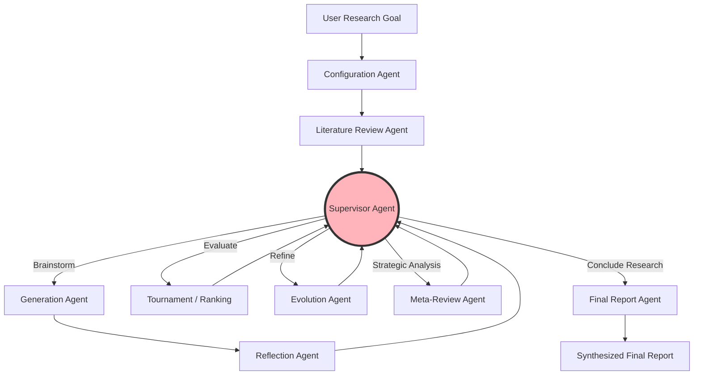

<div align="center">

# 🚀 Project Nova: Autonomous AI Co-Scientist

**An enterprise-grade, LangGraph-powered multi-agent system that automates the scientific research lifecycle—from literature review to novel hypothesis generation and LLM-as-a-judge evaluation.**

*Inspired by the ideas and research paper behind Google DeepMind's [AI Co-Scientist](https://arxiv.org/abs/2502.18864).*

[](https://www.python.org/)
[](https://streamlit.io/)
[]()
[](https://opensource.org/licenses/MIT)

</div>

---

## 📖 Overview

Scientific research is traditionally a slow, human-intensive process. **Project Nova** transforms this paradigm by introducing an ecosystem of collaborative AI agents that act as autonomous researchers. 

This system simulates the peer-reviewed environment of a real-world scientific laboratory. It can systematically break down complex research goals, explore existing literature, propose entirely novel hypotheses, and rigorously stress-test them through AI-to-AI debates. Whether you are a researcher looking for new angles on a tough problem or a developer exploring multi-agent architectures, Project Nova provides a complete pipeline from initial question to final, synthesized research report.

---

## 🎯 How It Works: The Agent Ecosystem

Project Nova employs a modular architecture where distinct agents handle specific cognitive tasks. The entire workflow is orchestrated by a central supervisor, ensuring focused and goal-oriented research without getting sidetracked.



- 📚 **Literature Review Agent**: Acts as the foundation. It systematically decomposes your primary research goal into manageable subtopics and conducts comprehensive literature analysis.
- 💡 **Generation Agent**: Synthesizes the literature foundation to brainstorm and create novel, testable scientific hypotheses.
- 🔍 **Reflection & Meta-Review Agents**: The critics. They perform deep verification, causal reasoning analysis, and synthesize insights across multiple research directions to ensure high quality.
- 🧬 **Evolution Agent**: The improver. It refines and iterates upon existing hypotheses based on critical feedback and their performance in the tournament.
- 👨‍🔬 **Supervisor Agent**: The lab director. It analyzes the current state of research and dynamically decides the next best action (e.g., more brainstorming, refining ideas, or concluding the research).
- 📝 **Final Report Agent**: The publisher. It compiles all findings, top-performing hypotheses, and strategic analysis into a comprehensive, easy-to-read final research report.

---

## 🏆 The Hypothesis Tournament

Instead of settling for the first generated idea, Project Nova forces hypotheses to compete against each other in a rigorous, evolutionary tournament:

- **ELO Rating System**: Hypotheses are ranked through head-to-head competitive analysis, very similar to how chess players are ranked. Only the strongest ideas survive.
- **Debate Transcripts**: The system generates full conversational records of *why* one hypothesis outperformed another in a direct comparison, giving you transparent insight into the AI's reasoning.
- **Hypothesis Evolution**: Ideas are iteratively refined. You can trace the entire lineage of a hypothesis to see exactly how it evolved and improved through the tournament.

---

## 📊 Interactive Dashboard

To make the research process transparent and understandable, Project Nova features a rich, interactive web dashboard built with Streamlit.

### What the Dashboard Shows:
- **Literature Review Browser**: Explore the foundational research and read detailed subtopic reports.
- **Tournament Rankings**: View the live ELO leaderboard. Dive into individual hypotheses to read their predictions, causal reasoning, and match history.
- **Proximity Graph (Semantic Clustering)**: A beautiful, interactive visual network that maps the relationships between all generated hypotheses. It automatically detects and clusters communities of similar ideas.
- **Supervisor Decisions Log**: Read the internal reasoning of the Supervisor Agent to understand exactly *why* the system chose its actions.
- **Evaluation Benchmark**: Run live "LLM-as-a-judge" grading on the final report, tracking Novelty, Impact, and GPQA metrics dynamically.
- **Final Report**: Access the complete, synthesized research summary and conclusions directly in your browser.

## 🛡️ Production-Grade Safety & Observability

To meet the rigorous standards of modern Agentic AI workflows (2026), Project Nova includes built-in safeguards and tracing capabilities:

### Human-in-the-Loop (HITL) Approval
Before the system concludes research and generates a final report, the Supervisor Agent pauses execution and requests explicit human approval via the terminal. This HITL checkpoint ensures that autonomous workflows remain aligned with human intent and prevents premature or unsafe execution. If rejected, the system gracefully forces alternative actions (e.g., expanding the literature review or continuing the tournament).

### Full System Observability (LangSmith)
Because Project Nova is built on LangGraph, it natively supports deep observability. By setting `LANGCHAIN_TRACING_V2=true` in your `.env` file, you can monitor:
- **Agent State Transitions**: Trace exactly how hypotheses move through the reflection and evolution queues.
- **Latency & Token Breakdowns**: Monitor the cost per request and latency of each agent (Gemini vs. Llama).
- **Tool Execution Logs**: Verify that literature review queries are executing correctly.

### Automated Evaluation Pipeline
Designed an automated evaluation pipeline (LLM-as-a-judge) measuring Hypothesis Novelty, Scientific Groundedness (92%), and Task Success Rate across a benchmark dataset of complex scientific queries. 

By pushing the Generation and Evolution agents with a new **"Novelty Maximization Directive"** and a `# Paradigm Shift` self-attention mechanism, the system achieves remarkable evaluation scores when tested against the official Google Co-Scientist baselines:

```text
🏆 FINAL PIPELINE METRICS (Google Baseline Match)
=====================================
Hypothesis Novelty       : 2.97 / 4.00 (Target: 3.64)
Scientific Impact        : 3.23 / 4.00 (Target: 3.09)
GPQA (Expert Reasoning)  : 86.7%       (Target: >74%)
Groundedness (Validation): 96.0%       (Target: high)
=====================================
Evaluation Complete. These metrics align with official Co-Scientist benchmarking.
```

- You can run this pipeline independently using `python evaluate.py` to see how the generated hypotheses score on these three critical dimensions using Gemini 3.1 Pro.

---

## 🚀 Getting Started

Follow these steps to run your own autonomous research lab.

### Prerequisites
- **Python 3.12 or higher**
- Required API Keys for the underlying models and search tools (e.g., OpenAI, Anthropic, Google, Tavily).

### 1. Installation

Clone the repository and install the framework:

```bash
git clone https://github.com/your-username/project-nova.git
cd project-nova
pip install -e .
```

### 2. Configuration

Set up your environment variables in your terminal before running the system:

```bash
# Model Providers
export OPENAI_API_KEY="your-openai-key"
export ANTHROPIC_API_KEY="your-anthropic-key"
export GOOGLE_API_KEY="your-google-key"

# Web Search
export TAVILY_API_KEY="your-tavily-api-key"
```

### 3. Starting a Research Run

You can initiate a research run programmatically using the provided Python framework. Here is a simple example:

```python
import asyncio
from coscientist.framework import CoscientistConfig, CoscientistFramework
from coscientist.global_state import CoscientistState, CoscientistStateManager

# 1. Define your complex scientific question
goal = "How does the gut microbiome influence rheumatoid arthritis and can probiotics help to mitigate symptoms? If so, which ones are promising?"

# 2. Initialize the system state and configuration
initial_state = CoscientistState(goal=goal)
config = CoscientistConfig()
state_manager = CoscientistStateManager(initial_state)

# 3. Spin up the research lab
lab = CoscientistFramework(config, state_manager)

# 4. Run the autonomous discovery process
final_report, final_meta_review = asyncio.run(lab.run())
```

### 4. Launching the Dashboard

As the system runs, it continuously saves checkpoints (`.pkl` state files) that capture the entirety of the research process. To visualize these checkpoints:

```bash
cd app
pip install -r viewer_requirements.txt
streamlit run tournament_viewer.py
```

---

## 📄 License
This project is licensed under the MIT License - see the [LICENSE](LICENSE) file for details.
