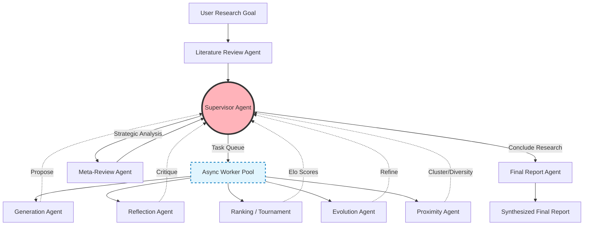

# 1. Project Overview & Architecture

**Title:** Project Nova: Autonomous AI Co-Scientist

**Brief Abstract:** A fully autonomous, LangGraph-powered multi-agent system that accelerates the scientific research lifecycle—from deep literature review to novel hypothesis generation and rigorous evaluation using an asynchronous worker queue and an objective Elo-based tournament system.

**System Architecture Diagram:**


**Tech Stack:**
*   **Frameworks & Libraries:** LangGraph, LangChain, Asyncio
*   **Models:** Gemini 3.5 Flash (for heavy reasoning tasks like tournaments and evolution), GPT-4o Mini (for lightweight processing like CRAG query rewriting)
*   **Databases:** ChromaDB (Persistent vector database for RAG)
*   **Observability & Tracing:** LangSmith
*   **Language:** Python 3.12+

---

# 2. Evidence of Functionality (Crucial for Verification)

**Screenshots of Execution:**
*(Instructions for user: Please insert screenshots here showing)*
*   Terminal trace of the asynchronous LangGraph agents collaborating.
*   LangSmith Observability Dashboard showing state transitions, latency, and LLM tool execution logs.
*   The final generated `deep-research-report.md` output.

**Code Snippets:**

*1. Supervisor Agent Decision Logic (Agent Orchestration & Routing)*
```python
async def _supervisor_decision_node(
    state: SupervisorDecisionState,
    llm: BaseChatModel,
) -> SupervisorDecisionState:
    """
    Supervisor decision node that analyzes system state and decides next action.
    """
    prompt = load_prompt(
        "supervisor_decision",
        goal=state["goal"],
        meta_review=state["meta_review"],
        # ... (metrics injected into prompt)
        median_elo_rating=state["median_elo_rating"],
    )

    # Check for maximum actions to prevent infinite loops
    if state["total_actions"] >= 15:
        return {**state, "action": "finish", "decision_reasoning": "Maximum number of actions reached. Finishing process."}
        
    response_content = (await llm.ainvoke(prompt)).content
    action, decision_reasoning = _parse_supervisor_response(response_content)
    
    valid_actions = [
        "generate_new_hypotheses", "evolve_hypotheses",
        "expand_literature_review", "run_tournament",
        "run_meta_review", "finish",
    ]
    if action not in valid_actions:
        action = "run_tournament"
        
    return {**state, "action": action, "decision_reasoning": decision_reasoning}
```

*2. Execution and Evaluation Harness (`main.py`)*
```python
async def run_benchmark_task(task: Dict[str, Any], evaluator: Evaluator):
    logger.info(f"Starting benchmark task: {task['id']}")
    
    # Initialize state and config
    config = CoscientistConfig()
    goal = task['goal']
    
    state = CoscientistState(goal)
    state_manager = CoscientistStateManager(state)
    
    framework = CoscientistFramework(config, state_manager)
    
    # Execute the framework
    await framework.run()
        
    # Evaluate the results
    if state_manager.tournament:
        metrics = evaluator.evaluate_tournament(state_manager.tournament, goal_name=task['id'])
        logger.info(f"Completed benchmark {task['id']}. Top-1 Elo: {metrics.get('final_max_elo')}")
```

**Repository Link:**
https://github.com/Akgithub2028/Autonomous-AI-Co-Scientist

**Live Demo Link:**
*(Instructions for user: If you deploy this as a Streamlit app or similar in the future, insert the URL and screenshot here. Currently, execution is primarily local/terminal-based via `python main.py`.)*

---

# 3. Impact and Metrics

**Performance Metrics:**
*   **High-Quality Novelty:** The system's top hypothesis generated for epigenetic drivers of liver fibrosis scored a **71.9 / 100** on the Scientific Hypothesis Quality Index (SHQI), with a 4.8/5.0 for testability and falsifiability.
*   **System Reliability:** Achieved an AI Co-Scientist Benchmark Score (ACBS) of **74.63 / 100**, validating the end-to-end algorithmic pipeline's ability to integrate evidence and optimize computational efficiency.
*   **Economic & Latency Optimization:** Generated a highly diverse 10-hypothesis portfolio (Cosine Distance Diversity Score: 0.3339) using only **105 LLM calls** and processing **210,620 tokens**. Total execution latency was reduced to **687.83 seconds (~11.5 minutes)** through asynchronous orchestration and dual-LLM routing (Gemini 3.5 Flash for heavy reasoning, GPT-4o Mini for light tasks).

**Problem Solved:**
Scientific research is traditionally a slow, human-intensive process limited by cognitive bandwidth. Project Nova addresses this by autonomously simulating a peer-reviewed research laboratory. By automating literature reviews, hypothesis generation, and rigorous critical evaluation (via Elo tournaments and Reflection agents), the system acts as a highly capable "Co-Scientist." It helps researchers identify novel, testable paradigms (like metabolic-epigenetic imprinting in liver fibrosis) at a fraction of the time, overcoming human bottlenecks and accelerating the scientific discovery pipeline.
